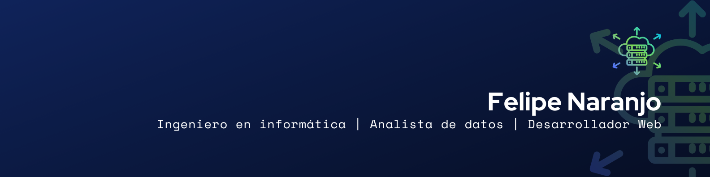

<h1 align="center">Hola mundo, ¡Bienvenidos a mi perfil! </h1>

### 👨🏻‍💻 &nbsp;Acerca de mí

💻 &nbsp;Soy un ingeniero en informática apasionado por las nuevas tecnologías y el aprendizaje.\
💡  &nbsp; Siempre dispuesto a aprender nuevas herramientas o reforzar conocimientos.\
🎓 &nbsp;Titulado en el Instituto Profesional Duoc UC.\
🌱 &nbsp;Mis fortalezas son el desarrollo web, el análisis de datos con herramientas BI y la programación.\
🎥 &nbsp;En mis tiempos libres me gusta realizar proyectos y ver videos relacionados con mi carrera.

---

## 🛠️ &nbsp;Herramientas que utilizo

### 🧑‍💻 Lenguajes

### ⚙️ Frameworks y librerías

  
  
  
  
  
  

### 🗃️ Bases de datos

  
  

### 🛠️ Otras herramientas

  
  
  
  
  
  
  
  
  
  

### 🔁 Control de versiones

### 📚 Plataformas de aprendizaje

---

## 📊 &nbsp;Estadísticas de GitHub

---

## 📫 &nbsp;Contacto

  
  

